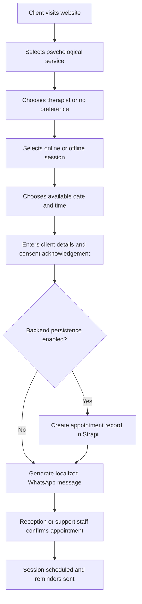
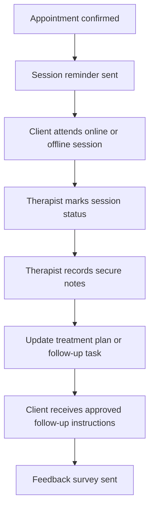
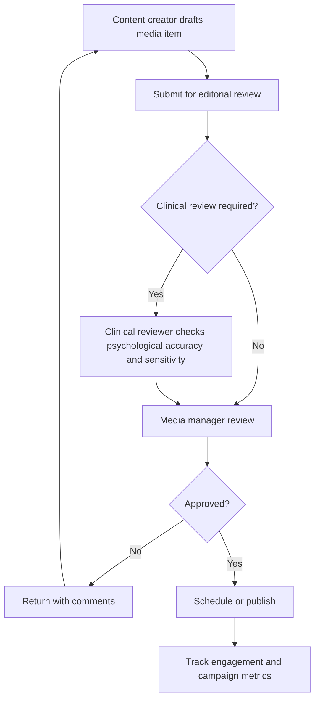

# Business Requirements Document (BRD)

## Warh Elshasha - Psychological Media, Mental Health Services & Support Platform

| Field | Detail |
| --- | --- |
| **Document Version** | 4.0 |
| **Date** | June 2, 2026 |
| **Project Name** | Warh Elshasha Psychological Services Platform |
| **Project Type** | Bilingual Psychological Media, Therapy Booking, Counseling Services, Support Programs & CMS Website |
| **Status** | Updated for Psychological Media, Mental Health Services, and Psychological Support Services |
| **Primary Source of Truth** | Current project requirements, React frontend, Strapi backend schemas, API services, language context, and this BRD |

---

## Table of Contents

1. [Executive Summary](#1-executive-summary)
2. [Business Overview](#2-business-overview)
3. [Vision & Mission](#3-vision--mission)
4. [Business Objectives](#4-business-objectives)
5. [Problem Statement](#5-problem-statement)
6. [Scope](#6-scope)
7. [Target Audience](#7-target-audience)
8. [Stakeholders](#8-stakeholders)
9. [User Personas](#9-user-personas)
10. [Business Requirements](#10-business-requirements)
11. [Functional Requirements](#11-functional-requirements)
12. [Psychological Media Requirements](#12-psychological-media-requirements)
13. [Content Requirements](#13-content-requirements)
14. [Information Architecture](#14-information-architecture)
15. [Business Processes & Workflows](#15-business-processes--workflows)
16. [User Journeys](#16-user-journeys)
17. [Data Model Overview](#17-data-model-overview)
18. [User Roles & Permissions](#18-user-roles--permissions)
19. [Integration Requirements](#19-integration-requirements)
20. [Non-Functional Requirements](#20-non-functional-requirements)
21. [Reporting Requirements & KPIs](#21-reporting-requirements--kpis)
22. [Compliance Requirements](#22-compliance-requirements)
23. [Security & Privacy](#23-security--privacy)
24. [Phasing & Prioritization](#24-phasing--prioritization)
25. [Future Enhancements](#25-future-enhancements)
26. [Assumptions & Constraints](#26-assumptions--constraints)
27. [Risks & Mitigations](#27-risks--mitigations)
28. [Glossary](#28-glossary)

---

## 1. Executive Summary

Warh Elshasha requires a bilingual, enterprise-grade digital platform for psychological media, mental health services, and psychological support services. The platform must help clients, families, organizations, and awareness audiences discover trusted psychological services, book consultations, access educational content, participate in awareness programs, and communicate securely with authorized care and support teams.

The platform will support online and offline therapy sessions, individual counseling, family counseling, couples counseling, child and adolescent counseling, psychological assessments, support groups, mental health awareness programs, and psychological media campaigns. It must also provide a CMS-backed publishing environment for articles, blogs, podcasts, educational videos, newsletters, awareness events, and social media campaign management.

The current implementation uses:

- React, TypeScript, Vite, React Router, TanStack Query, shadcn/Radix UI components, Tailwind CSS, Axios, and `qs` on the frontend.
- Strapi 5 as the backend CMS, with i18n-enabled content types and draft/publish workflows.
- English and Arabic language support with RTL switching, locale-aware Strapi API requests, and localStorage language persistence.
- WhatsApp handoff for consultation and appointment messages, with optional Strapi persistence for operational tracking.

The platform should prioritize client trust, confidentiality, service clarity, appointment conversion, therapist availability visibility, psychological record privacy, secure communication, content quality, bilingual accessibility, measurable campaign impact, and CMS maintainability. It must be suitable for mental health clinics, counseling centers, psychological support organizations, therapy platforms, mental health awareness organizations, and psychological media companies.

---

## 2. Business Overview

### 2.1 Brand

| Item | Detail |
| --- | --- |
| **Brand Name** | Warh Elshasha |
| **Arabic Name** | Localized Arabic brand name managed in Strapi |
| **Tagline** | Managed through Strapi site information |
| **Business Domain** | Psychological Media, Mental Health Services, and Psychological Support Services |
| **Service Focus** | Therapy booking, counseling services, psychological assessments, support groups, awareness programs, and psychological media publishing |
| **Care Delivery Modes** | Online video consultation, offline clinic sessions, hybrid follow-up, group sessions, and community awareness programs |
| **Primary Location Signal** | Managed through CMS contact, clinic branch, session location, and event location fields |

### 2.2 Positioning

Warh Elshasha positions itself as a trusted bilingual psychological services and media platform that combines professional mental health care, accessible counseling pathways, evidence-informed educational content, and structured awareness campaigns.

### 2.3 Business Model

The platform may support multiple revenue and operating models:

- Paid individual, family, couples, child, adolescent, and assessment sessions.
- Online and offline consultation booking.
- Session packages and subscriptions.
- Corporate or community mental health awareness programs.
- Paid workshops, support groups, and psychoeducational events.
- Sponsored or partnership-based psychological media campaigns where appropriate.
- Newsletter and content engagement programs.

### 2.4 Service Portfolio

| Service Area | Description |
| --- | --- |
| **Psychological Consultations** | Intake, triage, appointment booking, and therapist matching for online or offline care. |
| **Therapy Sessions** | Individual, family, couples, child, adolescent, and group therapy sessions delivered online or in person. |
| **Counseling Services** | Structured counseling support for emotional, relationship, family, behavioral, stress, and life-transition needs. |
| **Psychological Assessments** | Assessment booking, consent capture, scoring support, clinician notes, and client-facing follow-up. |
| **Support Groups** | Group program setup, scheduling, attendance, facilitation, and follow-up management. |
| **Awareness Programs** | Campaigns, events, webinars, workshops, and public education initiatives. |
| **Psychological Media** | Articles, blogs, podcasts, educational videos, social media campaigns, newsletters, and engagement analytics. |

---

## 3. Vision & Mission

### 3.1 Vision

Become a leading bilingual psychological services and media organization that improves access to trusted mental health support, reduces stigma, and empowers individuals, families, and communities through professional care and high-quality psychological education.

### 3.2 Mission

Deliver confidential, accessible, and compassionate psychological support through structured therapy services, qualified professionals, secure digital workflows, and responsible psychological media content that helps people understand, seek, and sustain mental well-being.

### 3.3 Values

| Value | Meaning |
| --- | --- |
| **Confidentiality** | Protect client identity, session details, psychological records, and sensitive communications. |
| **Clinical Integrity** | Support responsible service delivery through qualified professionals, clear treatment planning, and appropriate boundaries. |
| **Accessibility** | Provide bilingual, online, offline, and inclusive service pathways. |
| **Empathy** | Design services, content, and support flows around client dignity and emotional safety. |
| **Education** | Publish practical, respectful, and accurate psychological awareness content. |
| **Accountability** | Maintain auditability, approvals, reporting, and operational follow-up. |

---

## 4. Business Objectives

| # | Objective | Success Metric |
| --- | --- | --- |
| O1 | Present Warh Elshasha clearly as a psychological services and media organization | Visitors understand service categories, trust signals, care options, and primary booking CTA from the first page. |
| O2 | Support bilingual audiences | Users can switch between English and Arabic, with layout direction updating correctly. |
| O3 | Enable consultation and appointment booking | Clients can select service type, therapist, session mode, date/time, and submit a structured appointment request. |
| O4 | Support online and offline therapy delivery | Sessions can be scheduled for video consultation, clinic visit, or hybrid follow-up. |
| O5 | Manage therapist availability and utilization | Therapist schedules, capacity, blocked times, and booked sessions can be maintained and reported. |
| O6 | Centralize client and patient management | Authorized staff can manage intake details, appointment history, follow-ups, consent status, and service interactions. |
| O7 | Support digital notes and treatment plans | Therapists can maintain secure notes, care plans, assessment summaries, and follow-up actions subject to role permissions. |
| O8 | Publish psychological media content | Articles, blogs, podcasts, videos, newsletters, and campaigns can be created, approved, published, and measured. |
| O9 | Improve awareness program reach | Campaign reach, impressions, event participation, and content engagement can be tracked. |
| O10 | Maintain responsive, accessible, and trustworthy user experience | Public and operational pages work well on mobile, tablet, and desktop with clear fallbacks and accessible controls. |

---

## 5. Problem Statement

Clients and families often need psychological support but face friction in finding trusted professionals, understanding service options, confirming availability, protecting privacy, and booking suitable online or offline appointments. Mental health organizations also need a professional way to publish awareness content, manage campaigns, measure engagement, and coordinate client follow-up without relying on scattered chat messages, spreadsheets, or informal social media workflows.

The platform must centralize service discovery, consultation booking, therapist scheduling, psychological media publishing, secure client communication, and operational reporting while protecting client confidentiality and sensitive psychological records.

### 5.1 User Problems Solved

| # | Problem | Platform Response |
| --- | --- | --- |
| P1 | Clients need to know whether the organization is trustworthy | Show therapist profiles, credentials, service descriptions, testimonials where appropriate, values, confidentiality commitments, and contact channels. |
| P2 | Clients need to choose the right type of support | Provide clear pathways for individual, family, couples, child, adolescent, assessment, support group, and awareness services. |
| P3 | Clients need online and offline options | Label each service by delivery mode, location, video availability, schedule, and follow-up process. |
| P4 | Manual booking over chat lacks structure | Appointment flow captures service type, therapist preference, date/time, client details, consent status, and notes before WhatsApp or backend persistence. |
| P5 | Therapists need organized session operations | Provide therapist profiles, schedules, appointments, session status, notes, treatment plans, and follow-up tasks. |
| P6 | Content teams need controlled publishing | Strapi CMS provides draft/publish, localization, approval workflow, campaign tracking, and media management. |
| P7 | Arabic and English audiences need equal access | Provide language toggle, translated UI, localized CMS content, and RTL support. |
| P8 | Leadership needs measurable performance | Report active clients, completed sessions, attendance, satisfaction, utilization, content engagement, campaign reach, retention, and revenue metrics. |

---

## 6. Scope

### 6.1 In Scope

| Module | Description |
| --- | --- |
| **Public Website** | Home, About, Services, Therapists, Appointments, Support Groups, Assessments, Media/Articles, Events, Contact, Privacy, Terms, and Not Found pages. |
| **Bilingual Experience** | English and Arabic UI copy, language toggle, RTL/LTR direction switching, locale-aware API requests. |
| **Service Catalog** | CMS-managed psychological services with media, descriptions, eligibility guidance, therapist/department assignment, price, duration, session mode, and booking CTA. |
| **Therapist Profiles** | Professional profiles with specialization, credentials, languages, session modes, availability, bio, and booking links. |
| **Appointment Booking** | Multi-step consultation booking for online and offline sessions, including service selection, therapist selection where applicable, date/time, client details, consent, validation, WhatsApp message generation, optional Strapi record, and confirmation state. |
| **Session Management** | Session status tracking for requested, confirmed, rescheduled, cancelled, completed, no-show, and follow-up required. |
| **Client / Patient Management** | Client profile, contact details, appointment history, consent status, intake notes, support needs, follow-up tasks, and satisfaction feedback. |
| **Digital Notes and Treatment Plans** | Secure therapist notes, assessment summaries, treatment goals, follow-up plans, and progress notes subject to role-based access. |
| **Video Consultation Integration** | Support for approved video consultation links or integration metadata for online sessions. |
| **Support Groups Management** | Group program details, facilitator, schedule, capacity, participant list, attendance, and follow-up. |
| **Psychological Assessments** | Assessment catalog, booking, consent capture, result summary support, clinician notes, and follow-up recommendation workflow. |
| **Psychological Media CMS** | Articles, blogs, podcasts, educational videos, social campaigns, awareness events, newsletters, publishing workflow, approval workflow, and analytics metadata. |
| **Notifications and Reminders** | Appointment, session, payment, follow-up, event, and newsletter reminders through available channels. |
| **Payment and Subscription Management** | Payment status, session packages, subscriptions, invoices/receipts metadata, and manual or integrated payment readiness. |
| **Feedback and Surveys** | Post-session satisfaction surveys, service feedback, campaign feedback, and reporting. |
| **Contact Experience** | CMS-managed contact information, clinic locations, map URL, contact form UI, WhatsApp CTA, phone, email, and support links. |
| **CMS Content Management** | Strapi single types and collection types for page content, site information, services, therapists, appointments, articles, campaigns, legal pages, and media. |
| **Responsive UI** | Mobile, tablet, and desktop layouts using Tailwind and reusable UI components. |
| **Legal Pages** | Privacy Policy, Terms of Service, consent guidance, and confidentiality statements managed in Strapi blocks. |

### 6.2 Out of Scope

- Emergency crisis intervention or crisis hotline dispatch unless explicitly approved and staffed.
- Medical diagnosis automation, AI-generated diagnosis, or unsupervised clinical decision-making.
- Prescription, medication management, or psychiatric e-prescribing unless separately approved and legally authorized.
- Insurance claim processing unless added in a later healthcare administration phase.
- Full electronic health record replacement unless approved as a dedicated clinical records phase.
- Native mobile applications.
- Protected client portal authentication unless approved for the next phase.
- Automated assessment interpretation without qualified professional review.

---

## 7. Target Audience

| Audience | Needs |
| --- | --- |
| **Adults Seeking Individual Support** | Confidential therapy or counseling, clear service choices, online/offline appointments, privacy assurance, and follow-up. |
| **Couples and Families** | Family or relationship counseling, therapist fit, session coordination, privacy boundaries, and scheduling flexibility. |
| **Parents / Guardians** | Child and adolescent counseling, assessment guidance, consent management, therapist credentials, and safe communication. |
| **Young Adults and Students** | Accessible counseling, awareness content, stress and emotional support resources, and online session options. |
| **Corporate / Institutional Clients** | Awareness programs, workshops, campaigns, employee support programs, reporting, and program coordination. |
| **Community Organizations** | Support groups, events, psychoeducational programs, campaign participation, and community impact metrics. |
| **Content and Awareness Audiences** | Reliable psychological articles, videos, podcasts, newsletters, social campaigns, and events. |
| **Internal Operations Teams** | Booking management, therapist scheduling, client follow-up, campaign workflow, and reporting. |

---

## 8. Stakeholders

| Role | Responsibility |
| --- | --- |
| **Executive Leadership** | Approves strategic positioning, service model, privacy posture, investment priorities, and launch readiness. |
| **Clinical Leadership** | Approves psychological services, professional standards, assessment protocols, treatment documentation expectations, and risk boundaries. |
| **Therapists / Psychologists** | Provide sessions, maintain clinical notes, update treatment plans, manage follow-ups, and participate in approved content when applicable. |
| **Counselors** | Deliver counseling services, support groups, follow-up, and educational programs within authorized scope. |
| **Media and Content Team** | Creates articles, blogs, podcasts, videos, newsletters, campaigns, and awareness event content. |
| **Reception / Operations Team** | Manages appointment requests, confirmations, rescheduling, reminders, payment status, and client coordination. |
| **Compliance / Privacy Owner** | Oversees consent, confidentiality, data retention, audit logs, access control, and legal content. |
| **Clients / Patients** | Discover services, book appointments, attend sessions, communicate securely, provide consent, and submit feedback. |
| **Development Team** | Builds, tests, deploys, and maintains frontend/backend integration and technical architecture. |

---

## 9. User Personas

| Persona | Profile | Goals | Key Platform Needs |
| --- | --- | --- | --- |
| **Client / Patient** | Individual seeking private psychological support | Find a trusted therapist, book a suitable session, receive reminders, communicate securely | Clear services, confidentiality messaging, appointment booking, video/offline options, feedback flow |
| **Parent / Guardian** | Parent seeking child or adolescent support | Understand service fit, provide consent, schedule sessions, follow recommendations | Child/adolescent service pages, consent capture, therapist credentials, follow-up management |
| **Couple / Family Representative** | Person coordinating relationship or family support | Book family or couples counseling and coordinate attendance | Service eligibility, multi-person session notes, scheduling flexibility, privacy guidance |
| **Therapist / Psychologist** | Licensed or qualified mental health professional | Manage availability, conduct sessions, document notes, track treatment plans | Schedule, appointment list, secure notes, treatment plans, client history, video links |
| **Counselor** | Counseling professional or program facilitator | Manage counseling sessions, groups, and follow-up actions | Group scheduling, session notes, attendance, follow-up tasks |
| **Receptionist** | Front-desk or operations coordinator | Confirm bookings, reschedule, handle payment status, send reminders | Appointment queue, availability calendar, client contacts, status updates |
| **Content Creator** | Writer, producer, or educator | Draft educational psychological content | CMS editing, localization, media upload, draft workflow |
| **Media Manager** | Campaign and publishing lead | Approve content, publish campaigns, measure reach | Approval workflow, campaign calendar, analytics metadata, newsletter management |
| **Organization Admin** | Operational manager | Manage staff, services, reports, and settings | Role management, service configuration, reporting, audit visibility |
| **Support Staff** | Non-clinical support team member | Help clients with scheduling and operational questions | Limited client profile access, appointment support, communication history within permissions |

---

## 10. Business Requirements

### BR-1: Clear Psychological Services Positioning

The website must immediately communicate that Warh Elshasha provides psychological consultation, therapy, counseling, assessments, support groups, awareness programs, and psychological media content.

### BR-2: Bilingual Accessibility

The website must support English and Arabic audiences. Changing language must update text direction, local UI copy, and Strapi locale requests.

### BR-3: Service Discovery and Booking

Clients must be able to browse service categories, inspect service details, view therapist information, choose online or offline delivery, and submit appointment requests through a structured booking flow.

### BR-4: Therapist Scheduling and Availability

Authorized staff must be able to manage therapist profiles, working hours, available slots, blocked times, session modes, and capacity.

### BR-5: Session and Appointment Management

The platform must support appointment statuses, session status tracking, rescheduling, cancellation, completion, no-show handling, and follow-up actions.

### BR-6: Client / Patient Management

Authorized users must be able to manage client profiles, intake details, consent status, appointment history, session summaries, follow-up records, and satisfaction feedback.

### BR-7: Secure Therapist-Client Communication

The platform must support secure communication pathways or integration-ready communication records for therapist-client interaction, with role-based visibility and confidentiality controls.

### BR-8: Digital Notes and Treatment Plans

Therapists and authorized clinical roles must be able to maintain secure digital notes, psychological assessment summaries, treatment goals, follow-up recommendations, and progress notes.

### BR-9: Psychological Media Publishing

The platform must support articles, blogs, podcasts, educational videos, newsletters, awareness events, social campaigns, publishing workflow, approval workflow, and engagement analytics.

### BR-10: Support Group and Awareness Program Management

The system must support group programs, community events, mental health awareness campaigns, participant registration, attendance, content resources, and post-event feedback.

### BR-11: Payment and Subscription Readiness

The platform must support payment status, session packages, subscriptions, revenue reporting, and integration readiness for approved online payment providers.

### BR-12: Trust, Privacy, and Compliance

The platform must protect client confidentiality, session privacy, psychological records, consent records, audit logs, data retention policies, role-based access control, and encryption requirements.

---

## 11. Functional Requirements

### 11.1 Global Layout

| ID | Requirement |
| --- | --- |
| FR-1 | Provide a sticky responsive header. |
| FR-2 | Display CMS-managed logo when available, with a text fallback. |
| FR-3 | Display CMS-managed navigation links from `site-information.Pages`. |
| FR-4 | Provide a language toggle between `en` and `ar`. |
| FR-5 | Persist selected language in localStorage. |
| FR-6 | Set `document.documentElement.lang` and `dir` based on language. |
| FR-7 | Provide a primary booking CTA linking to `/booking`. |
| FR-8 | Provide a responsive mobile menu. |
| FR-9 | Provide footer content using brand, quick links, service links, contact info, social links, copyright, privacy, terms, and confidentiality links. |

### 11.2 Home Page

| ID | Requirement |
| --- | --- |
| FR-10 | Render CMS-managed hero content with two CTA buttons and optional hero background. |
| FR-11 | Show service categories, therapist trust signals, stats, why-choose cards, impact content, testimonials where appropriate, awareness highlights, and final CTA where CMS content exists. |
| FR-12 | Provide fallback translated text when CMS content is unavailable. |
| FR-13 | Provide clear non-emergency positioning and direct users to local emergency resources if emergency guidance content is configured. |

### 11.3 About Page

| ID | Requirement |
| --- | --- |
| FR-14 | Render hero, story, stats, mission, vision, values, experts, gallery, and CTA sections from Strapi. |
| FR-15 | Support media rendering for story, therapist/psychologist avatars, and gallery images. |
| FR-16 | Explain organizational identity, clinical values, media mission, confidentiality commitments, and credibility. |

### 11.4 Services Page

| ID | Requirement |
| --- | --- |
| FR-17 | Present psychological service categories including consultations, individual counseling, family counseling, couples counseling, child/adolescent counseling, assessments, support groups, and awareness programs. |
| FR-18 | Use service section components for hero, service categories, benefits, eligibility guidance, delivery modes, stats, media, and buttons. |
| FR-19 | Route users toward therapist profiles, service details, support groups, assessment booking, or appointment actions. |

### 11.5 Therapists Page

| ID | Requirement |
| --- | --- |
| FR-20 | Fetch and display all published localized therapist profiles. |
| FR-21 | Display therapist image, name, title, specialization, credentials, languages, session modes, availability summary, and profile CTA. |
| FR-22 | Allow filtering or grouping by specialization, service type, language, and online/offline availability where supported. |
| FR-23 | Link each therapist to a detail page or booking flow using Strapi `documentId`. |

### 11.6 Therapist Details Page

| ID | Requirement |
| --- | --- |
| FR-24 | Load a single therapist profile by Strapi `documentId`. |
| FR-25 | Display bio, credentials, areas of support, services offered, languages, session modes, locations, availability, and booking CTA. |
| FR-26 | Provide a booking CTA that passes therapist ID, therapist name, service category, and session mode to `/booking`. |
| FR-27 | Provide a clear not-found/draft guidance state when a therapist cannot be loaded. |

### 11.7 Appointment Booking Page

| ID | Requirement |
| --- | --- |
| FR-28 | Support direct booking from URL parameters such as `service_id`, `therapist_id`, `session_id`, `service`, `delivery_mode`, `date`, and `time`. |
| FR-29 | If no service or therapist is preselected, allow users to choose a psychological service, therapist preference, and session mode from published CMS entries. |
| FR-30 | For online consultations, allow video consultation booking without requiring a physical location. |
| FR-31 | For offline sessions, require users to choose an available CMS-managed date/time slot and location where multiple slots exist. |
| FR-32 | Collect name, email, phone, service type, selected therapist if applicable, selected slot where applicable, client age group, consent acknowledgement, and optional message. |
| FR-33 | Validate required fields at each step. |
| FR-34 | Build a localized WhatsApp message containing booking type, service/session, therapist preference, delivery mode, date, time, client details, consent acknowledgement, and notes. |
| FR-35 | Use the phone contact from `site-information.contact` where available, falling back to the configured default number. |
| FR-36 | Open WhatsApp in a new browser tab and show confirmation state. |
| FR-37 | Optionally create an `appointment` or `booking` record in Strapi before WhatsApp handoff when backend persistence is enabled. |
| FR-38 | Communicate payment, cancellation, confidentiality, and access rules clearly, including offline payment at clinic location or admin follow-up for online consultation access when applicable. |

#### 11.7.1 Booking Logic Rules

| ID | Rule |
| --- | --- |
| BL-1 | Booking type must be one of `consultation`, `therapy_session`, `counseling_session`, `assessment`, `support_group`, or `awareness_event`. |
| BL-2 | Online session bookings require service selection, client contact details, consent acknowledgement, and video access handling; date/time is required when therapist scheduling is enabled. |
| BL-3 | Offline session bookings require service selection, available slot, location confirmation, client contact details, and consent acknowledgement. |
| BL-4 | The booking flow must block submission when required fields are missing or the selected slot is full, cancelled, closed, unavailable, or unpublished. |
| BL-5 | When Strapi persistence is enabled, new records should start with status `new` or `pending_confirmation`. |
| BL-6 | Appointment status values should include `new`, `pending_confirmation`, `confirmed`, `rescheduled`, `cancelled`, `completed`, `no_show`, and `follow_up_required`. |
| BL-7 | Therapist availability should be calculated from schedule capacity minus confirmed appointments when persistence is enabled; otherwise availability status is manually managed in Strapi. |
| BL-8 | WhatsApp messages must include enough information for reception or support staff to identify the selected service and follow up without asking the client to repeat submitted data. |
| BL-9 | Child and adolescent booking flows must support parent/guardian contact and consent metadata. |

### 11.8 Online Therapy and Video Consultation

| ID | Requirement |
| --- | --- |
| FR-39 | Online session details must display service type, therapist, duration, price, preparation notes, and secure video access guidance. |
| FR-40 | The system must support storing approved video consultation link metadata or integration references for confirmed sessions. |
| FR-41 | Video consultation access should only be visible to authorized staff and the relevant client when authenticated client portal functionality is enabled. |
| FR-42 | Session reminders must include delivery mode and online access instructions only after confirmation. |

### 11.9 Offline Sessions and Clinic Appointments

| ID | Requirement |
| --- | --- |
| FR-43 | Provide offline appointment listing or filter state showing services with `deliveryMode = offline` or `hybrid`. |
| FR-44 | Offline session cards must display service name, therapist or counselor, date, time, location, capacity/availability status, price, and booking CTA. |
| FR-45 | Offline session details must display location/map link, duration, therapist, preparation notes, cancellation policy, and attendance notes. |
| FR-46 | Full or unavailable sessions must prevent or clearly discourage new bookings based on CMS availability status. |

### 11.10 Psychological Assessments

| ID | Requirement |
| --- | --- |
| FR-47 | Display assessment types, intended audience, duration, requirements, consent guidance, and follow-up process. |
| FR-48 | Allow assessment booking through the appointment flow. |
| FR-49 | Support secure internal assessment notes, result summaries, recommendations, and follow-up actions. |
| FR-50 | Prevent public exposure of assessment results, psychological records, or sensitive client information. |

### 11.11 Support Groups

| ID | Requirement |
| --- | --- |
| FR-51 | Display support group name, topic, facilitator, schedule, delivery mode, capacity, eligibility guidance, price/free status, and registration CTA. |
| FR-52 | Support participant registration, attendance status, group session status, and follow-up notes. |
| FR-53 | Allow support group resources or related articles to be linked from CMS. |

### 11.12 Session Management

| ID | Requirement |
| --- | --- |
| FR-54 | Authorized staff can view appointment and session lists filtered by date, therapist, service type, status, and delivery mode. |
| FR-55 | Therapists can update session status, enter secure notes, record follow-up actions, and update treatment plans. |
| FR-56 | Receptionists can confirm, reschedule, cancel, and mark operational payment status without accessing restricted therapy notes. |
| FR-57 | Support staff can manage allowed follow-up tasks and communications according to role permissions. |

### 11.13 Client / Patient Management

| ID | Requirement |
| --- | --- |
| FR-58 | Authorized users can create and update client profiles, contact details, consent records, age group, guardian information where applicable, service history, and appointment history. |
| FR-59 | Client records must separate operational information from restricted clinical notes. |
| FR-60 | Follow-up management must support due dates, owner, status, priority, notes, and reminders. |
| FR-61 | Feedback and satisfaction surveys must be linked to completed sessions, events, or support group programs. |

### 11.14 Payment and Subscription Management

| ID | Requirement |
| --- | --- |
| FR-62 | Support payment status values such as `unpaid`, `pending`, `paid`, `partially_paid`, `refunded`, and `waived`. |
| FR-63 | Support service prices, session packages, subscription plans, renewal dates, and revenue reporting metadata. |
| FR-64 | Online payment integration must be configurable in a future phase without changing the core appointment model. |

### 11.15 Articles and Blog Page

| ID | Requirement |
| --- | --- |
| FR-65 | Fetch `blogs-page` CMS content for article listing hero. |
| FR-66 | Fetch all localized published `blogs`. |
| FR-67 | Display article image, title, excerpt, author, date, estimated read time, topic/category, and read-more link. |
| FR-68 | Paginate article cards on the client with a configurable number of articles per page. |
| FR-69 | Display empty state when no articles exist. |

### 11.16 Article Details Page

| ID | Requirement |
| --- | --- |
| FR-70 | Load article details by route slug/document identifier as implemented. |
| FR-71 | Display title, author, reviewer where applicable, date, image, rich content, author bio/supporting content, related services, and related/more articles when available. |
| FR-72 | Provide a back-to-articles navigation path. |
| FR-73 | Include non-crisis educational disclaimers where configured by CMS. |

### 11.17 Contact Page

| ID | Requirement |
| --- | --- |
| FR-74 | Fetch `contact-page` title, description, info items, form labels/placeholders, WhatsApp content, clinic locations, and map URL. |
| FR-75 | Render phone, email, and location contact cards with appropriate links. |
| FR-76 | Provide a WhatsApp CTA from CMS content or fallback. |
| FR-77 | Provide a contact form UI with required name, email, and message fields. |
| FR-78 | Show validation and success toast feedback. |
| FR-79 | Display emergency disclaimer or crisis-resource redirection text when configured by the organization. |

### 11.18 Legal Pages

| ID | Requirement |
| --- | --- |
| FR-80 | Fetch and render Privacy Policy content from the `privacy-page` single type. |
| FR-81 | Fetch and render Terms of Service content from the `terms-page` single type. |
| FR-82 | Fetch and render consent, confidentiality, cancellation, and data-use content where configured. |
| FR-83 | Support Strapi blocks content for legal copy. |

---

## 12. Psychological Media Requirements

### 12.1 Media Content Management

| ID | Requirement |
| --- | --- |
| PM-1 | Support articles management, including categories, authors, reviewers, excerpts, images, rich text, status, and localization. |
| PM-2 | Support blogs management for shorter editorial, awareness, and campaign-related content. |
| PM-3 | Support podcasts management, including episode title, host, guest, audio file/embed URL, transcript, duration, episode number, and publishing status. |
| PM-4 | Support educational videos management, including title, topic, video file/embed URL, presenter, duration, transcript/summary, preview image, and publishing status. |
| PM-5 | Support newsletter management, including issue title, audience segment, content blocks, send date, status, and engagement metadata. |
| PM-6 | Support awareness event management, including event title, topic, location or online link, schedule, speaker/facilitator, registration CTA, capacity, and feedback collection. |

### 12.2 Campaign Management

| ID | Requirement |
| --- | --- |
| PM-7 | Support social media campaign management, including campaign objective, audience, start/end dates, channels, linked content, assets, owner, approval status, and performance metrics. |
| PM-8 | Allow campaign content to link to services, support groups, assessments, events, and educational resources. |
| PM-9 | Track campaign reach, impressions, clicks, shares, registrations, appointment leads, and engagement rate where data is available. |

### 12.3 Publishing and Approval Workflow

| ID | Requirement |
| --- | --- |
| PM-10 | Support draft, review, approved, scheduled, published, unpublished, archived, and rejected statuses. |
| PM-11 | Content creators can draft and submit content for review. |
| PM-12 | Media managers can review, approve, schedule, publish, unpublish, and archive content. |
| PM-13 | Clinical reviewers or authorized therapists can approve psychologically sensitive content before publication where required. |
| PM-14 | Approval history must store reviewer, timestamp, decision, and comments. |

### 12.4 Analytics and Engagement Tracking

| ID | Requirement |
| --- | --- |
| PM-15 | Track content views, reads/listens/views, average engagement, shares, CTA clicks, newsletter signups, and related appointment leads where integrated. |
| PM-16 | Track campaign reach and impressions across supported channels where analytics data is available. |
| PM-17 | Provide dashboard-ready metadata for high-performing topics, audience interest, campaign ROI, and content conversion. |

---

## 13. Content Requirements

### 13.1 Required Public Copy Areas

| Area | CMS / Source |
| --- | --- |
| Site logo, navigation, social links, contact links, copyright | `site-information` |
| Home page hero, stats, why choose, impact, testimonials, awareness highlights, CTA | `home-page` |
| About hero, story, mission, vision, values, experts, gallery, CTA | `about-page` |
| Services hero, categories, eligibility guidance, delivery modes, CTA | `service-page` |
| Therapists page hero and filters | `therapists-page` |
| Therapist records | `therapist` collection |
| Psychological service records | `service` collection |
| Appointment and booking records, when persistence is enabled | `appointment` or `booking` collection |
| Therapist availability and schedule slots | `therapist-schedule` / `availability-slot` collection or repeatable schedule components |
| Client/patient records, when operational module is enabled | `client` collection |
| Session notes and treatment plans, when clinical module is enabled | restricted clinical collections or components |
| Support groups | `support-group` collection |
| Psychological assessments | `assessment` collection |
| Awareness events | `awareness-event` collection |
| Campaign records | `campaign` collection |
| Articles page title/span/description | `blogs-page` |
| Article/blog records | `blog` collection |
| Podcast episodes | `podcast` collection |
| Educational videos | `educational-video` collection |
| Newsletter issues | `newsletter` collection |
| Contact page title, description, info, form, map | `contact-page` |
| Privacy policy | `privacy-page` |
| Terms of service | `terms-page` |
| Consent and confidentiality content | `consent-page` / `confidentiality-page` where configured |

### 13.2 Language Requirements

- English and Arabic content must be maintained for all user-facing CMS entries where available.
- The frontend must request the active locale through the Axios request interceptor.
- Static fallback translations must remain available for critical navigation, form validation, booking flow, consent copy, confidentiality notices, and error states.
- Arabic pages must use RTL layout direction.
- Therapist credentials, consent notices, and legal content must be reviewed carefully in both languages before publication.

### 13.3 Media Requirements

- Service, therapist, article, campaign, event, and media cards require meaningful images when available.
- Podcast audio and educational video assets must be uploaded to Strapi media or configured as approved external media URLs.
- Video and podcast records must include readable titles, order/episode number where applicable, duration where known, transcript/summary where available, and publishing status.
- Offline appointment, support group, and event entries should include location details and map links where available.
- Gallery and expert sections should use optimized images with alt text in Strapi where possible.
- Media URLs must be resolved through the Strapi base URL helper.
- Content must avoid exposing sensitive client information in images, stories, examples, or testimonials without explicit documented consent.

---

## 14. Information Architecture

### 14.1 Public Routes

| Route | Purpose |
| --- | --- |
| `/` | Home page |
| `/about` | Organization profile, values, mission, vision, and credibility |
| `/services` | Psychological services overview |
| `/therapists` | Therapist and psychologist profiles |
| `/therapists/:id` | Therapist details by Strapi document ID |
| `/appointments` | Appointment landing or service booking entry point |
| `/booking` | Consultation, therapy, counseling, assessment, event, and support group booking flow |
| `/support-groups` | Support group listing |
| `/assessments` | Psychological assessment listing |
| `/awareness-events` | Awareness event listing |
| `/articles` | Psychological media/article listing |
| `/articles/:slug` | Article detail |
| `/podcasts` | Podcast listing |
| `/videos` | Educational video listing |
| `/contact` | Contact, location, and WhatsApp paths |
| `/privacy` | Privacy Policy |
| `/terms` | Terms of Service |
| `/consent` | Consent and confidentiality guidance where enabled |
| `*` | Not Found page |

### 14.2 Navigation Principles

- Public navigation should foreground services, therapists, booking, media, and contact paths.
- Client-sensitive operational views should not be publicly linked unless authentication is implemented.
- Campaign and media content should route users to relevant services, events, support groups, or booking CTAs.
- Legal and confidentiality content must remain discoverable from the footer and relevant booking flows.

---

## 15. Business Processes & Workflows

### 15.1 Consultation Booking Workflow

### 15.2 Therapy Session Management Workflow

### 15.3 Psychological Media Publishing Workflow

### 15.4 Support Group Workflow

| Step | Description |
| --- | --- |
| 1 | Organization admin or counselor creates support group topic, facilitator, schedule, capacity, eligibility guidance, and delivery mode. |
| 2 | Media/content team publishes public group description and related educational content. |
| 3 | Clients register interest through booking/registration flow. |
| 4 | Receptionist or support staff confirms participation and shares attendance instructions. |
| 5 | Facilitator records attendance and follow-up actions after each group session. |
| 6 | Feedback survey and engagement metrics are reviewed for program improvement. |

### 15.5 Assessment Workflow

| Step | Description |
| --- | --- |
| 1 | Client or guardian reviews assessment type, requirements, consent language, and follow-up process. |
| 2 | Client books assessment appointment. |
| 3 | Reception confirms schedule, payment status, and required preparation. |
| 4 | Therapist/psychologist conducts assessment and records restricted notes/results. |
| 5 | Therapist prepares summary and follow-up recommendations according to professional policy. |
| 6 | Authorized staff schedules follow-up session where needed. |

---

## 16. User Journeys

| Journey | Path |
| --- | --- |
| Understand the organization | Home -> About -> Services |
| Book an individual therapy session | Home -> Services -> Therapist Profile -> Booking -> Confirmation / WhatsApp Follow-up |
| Book a family or couples counseling session | Services -> Family/Couples Counseling -> Booking -> Reception Confirmation |
| Book child or adolescent counseling | Services -> Child/Adolescent Counseling -> Consent Guidance -> Booking -> Parent/Guardian Follow-up |
| Book a psychological assessment | Assessments -> Assessment Details -> Booking -> Confirmation -> Follow-up Session |
| Join a support group | Support Groups -> Group Details -> Registration/Booking -> Confirmation -> Attendance Reminder |
| Attend online consultation | Booking -> Confirmation -> Video Consultation Instructions -> Session -> Feedback Survey |
| Attend offline clinic session | Booking -> Confirmation -> Location/Map -> Session -> Follow-up |
| Learn through psychological media | Articles/Podcasts/Videos -> Content Detail -> Related Services or Booking CTA |
| Engage with awareness campaign | Campaign Landing/Event -> Registration or Content -> Newsletter Signup -> Engagement Tracking |
| Ask a question | Contact -> Phone/Email/WhatsApp/Form |
| Switch language | Header language toggle -> localized content and RTL/LTR update |

---

## 17. Data Model Overview

### 17.1 Strapi Single Types

| Content Type | Purpose |
| --- | --- |
| `home-page` | Home page sections. |
| `about-page` | About page sections. |
| `service-page` | Psychological services page sections. |
| `therapists-page` | Therapist listing page hero, intro copy, filters, and CTA. |
| `appointments-page` | Appointment/booking entry page hero, intro copy, and CTA if separate from `/booking`. |
| `support-groups-page` | Support group listing page hero and intro copy. |
| `assessments-page` | Assessment listing page hero and intro copy. |
| `awareness-events-page` | Awareness events page hero and intro copy. |
| `blogs-page` | Articles listing page hero metadata. |
| `podcasts-page` | Podcast listing page hero metadata. |
| `videos-page` | Educational video listing page hero metadata. |
| `contact-page` | Contact page copy, contact blocks, form labels, map URL. |
| `site-information` | Logo, navigation pages, social links, contact info, copyright. |
| `privacy-page` | Privacy Policy. |
| `terms-page` | Terms of Service. |
| `consent-page` | Consent and confidentiality guidance where configured. |

### 17.2 Strapi Collection Types

| Content Type | Key Fields |
| --- | --- |
| `service` | title, image, serviceType, tagline, desc, duration, price, deliveryMode, eligibleAudience, benefits, requirements, therapist relations, availability status, booking CTA, contact phone/email/address. |
| `therapist` | name, image, title, credentials, license/qualification fields where applicable, specialization, bio, languages, services, session modes, locations, availability summary, status. |
| `availability-slot` | therapist relation, service relation, date, start time, end time, capacity, available seats/status, location, map URL, video-enabled flag, notes. |
| `appointment` | booking type, service relation, therapist relation, selected slot, client relation, name, email, phone, age group, guardian information where applicable, message, delivery mode, consent acknowledgement, payment status, appointment status, source, locale, created date. |
| `client` | client code, name, contact details, age group, guardian details where applicable, consent status, communication preferences, appointment history, follow-up status. |
| `session-note` | appointment relation, client relation, therapist relation, note type, restricted note content, treatment plan relation, follow-up actions, visibility scope, created/updated metadata. |
| `treatment-plan` | client relation, therapist relation, goals, interventions, follow-up cadence, progress notes, status, next review date. |
| `assessment` | title, audience, description, duration, requirements, consent requirements, price, therapist relations, follow-up process, status. |
| `support-group` | title, topic, facilitator, schedule, capacity, eligibility guidance, delivery mode, price/free status, participant records, attendance status, resources. |
| `awareness-event` | title, topic, description, date/time, location/online link, speakers, registration CTA, capacity, campaign relation, feedback status. |
| `campaign` | title, objective, audience, channels, linked content, start/end dates, owner, approval status, reach, impressions, clicks, engagement rate, notes. |
| `blog` | title, slug, excerpt, content, author, reviewer, date, image, topic/category, disclaimer, related services. |
| `podcast` | title, slug, episode number, host, guest, audio file/embed URL, transcript, duration, image, status. |
| `educational-video` | title, slug, presenter, video file/embed URL, transcript/summary, duration, image, topic/category, status. |
| `newsletter` | title, audience segment, content blocks, scheduled date, status, opens, clicks, unsubscribes where integrated. |
| `feedback-survey` | related session/event/content, client/contact relation where applicable, rating, satisfaction score, comments, created date. |

### 17.3 Shared Components

| Component Group | Examples |
| --- | --- |
| `global` | stats, CTA, button, card, links pages, social icon, contact info, confidentiality notice. |
| `home` | hero, why choose, impact, testimonials, awareness highlights. |
| `about` | hero, story, mission, vision, values, experts, gallery. |
| `services` | hero, service categories, delivery modes, benefits, eligibility guidance. |
| `therapists` | profile card, credentials, specializations, availability summary. |
| `appointments` | booking steps, consent acknowledgement, slot selector, status labels. |
| `support-groups` | schedule, facilitator, capacity, eligibility, attendance notes. |
| `media` | article metadata, podcast metadata, video metadata, campaign metadata, approval status. |
| `contact` | info, form, WhatsApp info, content sections, crisis disclaimer where configured. |

---

## 18. User Roles & Permissions

### 18.1 Role Definitions

| Role | Primary Responsibilities | Access Level |
| --- | --- | --- |
| **Super Admin** | Configure platform, manage all organizations, users, roles, settings, audit visibility, and system-level content. | Full system access. |
| **Organization Admin** | Manage organization services, staff, schedules, reports, content settings, payment configuration, and operational workflows. | Organization-level administrative access. |
| **Therapist / Psychologist** | Manage own profile, availability, sessions, clinical notes, assessments, treatment plans, and follow-ups. | Restricted clinical access to assigned clients and sessions. |
| **Counselor** | Manage counseling appointments, support groups, notes within authorized scope, attendance, and follow-ups. | Restricted service access to assigned clients/groups. |
| **Content Creator** | Draft articles, blogs, podcasts, videos, newsletter content, and campaign materials. | Draft content access; no clinical records access. |
| **Media Manager** | Review, approve, schedule, publish, archive, and measure media campaigns and content. | Media workflow access; no clinical records access unless separately authorized. |
| **Receptionist** | Manage appointment requests, confirmations, rescheduling, payment status, reminders, and operational client contacts. | Operational access; no restricted therapy note access. |
| **Client / Patient** | Browse services, submit booking requests, attend sessions, receive reminders, consent, communicate securely, and provide feedback. | Own information only when client portal is enabled. |
| **Support Staff** | Assist with scheduling, follow-up, event support, communication logs, and client support tasks. | Limited operational access based on assigned duties. |

### 18.2 Public Users

Public users can:

- Browse all published pages.
- Switch language.
- View psychological services, therapist profiles, support groups, assessments, events, articles, podcasts, and educational videos.
- Submit contact form UI.
- Start consultation, appointment, support group, event, or assessment booking.
- Use phone, email, map, and WhatsApp links.

### 18.3 CMS Users

CMS users can, according to assigned role:

- Log into Strapi admin.
- Create, edit, localize, publish, unpublish, and manage draft content.
- Upload and manage media.
- Create and manage services, therapist profiles, availability slots, articles, blogs, podcasts, videos, newsletters, campaigns, awareness events, and legal pages.
- Manage appointment and booking records when backend persistence is enabled.
- Access client or clinical records only when explicitly authorized.

### 18.4 Development / Admin Users

Development/admin users can:

- Configure Strapi environment variables and API tokens.
- Manage deployment settings.
- Maintain frontend API integration and build pipeline.
- Implement access controls, audit logging, encryption, and integration configuration.

---

## 19. Integration Requirements

| Integration | Requirement |
| --- | --- |
| **Strapi REST API** | Frontend fetches content using Axios and Strapi populate queries. |
| **Strapi i18n** | API requests include active locale from localStorage. |
| **Strapi Media** | Frontend resolves relative media paths with configured Strapi base URL. |
| **Strapi Appointment Records** | If enabled, frontend creates appointment records for consultations, therapy, counseling, assessments, support groups, and events before WhatsApp handoff. |
| **Therapist Availability** | Availability and slot data must be managed through Strapi collections/components or an approved scheduling integration. |
| **WhatsApp** | Booking flow opens `wa.me` URL with encoded consultation or appointment message. |
| **Video Consultation** | System supports approved video links or future integration with secure video consultation providers. |
| **Google Maps / Map Links** | Contact, clinic, event, and offline session links open map destination or configured map URL. |
| **Email / Phone Links** | Contact cards use `mailto:` and `tel:` links where applicable. |
| **Payment Provider** | Future online payment integration must support payment status updates, transaction references, packages, subscriptions, and revenue reporting. |
| **Analytics** | Analytics integration should support content engagement, campaign reach, appointment leads, and conversion tracking. |
| **Newsletter Provider** | Future newsletter integration should support subscriber lists, send status, opens, clicks, and unsubscribe metadata. |

---

## 20. Non-Functional Requirements

| Category | Requirement |
| --- | --- |
| **Performance** | Pages should lazy-load data through TanStack Query and avoid unnecessary refetching. |
| **Responsiveness** | Layout must work across mobile, tablet, and desktop. |
| **Accessibility** | Navigation, forms, buttons, language toggle, links, and appointment flows should be keyboard-accessible and clearly labeled. |
| **Localization** | Arabic layout must set RTL direction; English layout must set LTR direction. |
| **Reliability** | Pages must provide loading, empty, fallback, and not-found states for CMS/API failures. |
| **Privacy by Design** | Sensitive client data, psychological records, session notes, and consent records must be protected by role, purpose, and retention policy. |
| **Secure Communication** | Therapist-client communication and appointment coordination must use approved secure channels or controlled handoff processes. |
| **Clinical Record Safety** | Psychological notes and treatment plans must not be exposed through public APIs or public frontend routes. |
| **Media Delivery** | Podcast and video files should be compressed, browser-compatible, and served from Strapi media or an approved media host/CDN. |
| **Maintainability** | API helpers, types, hooks, and Strapi populate configs should stay centralized. |
| **Browser Support** | Support modern evergreen browsers. |
| **SEO Readiness** | Public pages should use clear page titles/content hierarchy and crawlable content where the SPA deployment allows. |
| **Auditability** | Administrative, content approval, appointment status, consent, and clinical-record access actions should be auditable where backend support exists. |

---

## 21. Reporting Requirements & KPIs

### 21.1 Operational Reports

| Report | Purpose |
| --- | --- |
| **Appointment Pipeline Report** | Track new, pending, confirmed, cancelled, rescheduled, completed, no-show, and follow-up-required appointments. |
| **Therapist Utilization Report** | Measure booked hours, available hours, completed sessions, cancellations, and utilization by therapist. |
| **Client Activity Report** | Track active clients, new clients, returning clients, service type, and follow-up status. |
| **Session Attendance Report** | Compare scheduled sessions with attended, cancelled, and no-show sessions. |
| **Revenue Report** | Track paid sessions, packages, subscriptions, outstanding payments, refunds, and revenue by service line. |
| **Support Group Report** | Track group registration, attendance, capacity, facilitator utilization, and feedback. |
| **Assessment Report** | Track assessment bookings, completions, follow-up recommendations, and service demand. |

### 21.2 Media and Awareness Reports

| Report | Purpose |
| --- | --- |
| **Content Engagement Report** | Track views, reads, listens, video views, CTA clicks, and engagement rate by content type. |
| **Campaign Performance Report** | Track reach, impressions, clicks, registrations, appointment leads, and conversion rate by campaign. |
| **Newsletter Report** | Track subscriber count, sends, opens, clicks, unsubscribes, and content interest. |
| **Awareness Event Report** | Track event registrations, attendance, feedback, and related content engagement. |

### 21.3 KPIs

| KPI | Definition |
| --- | --- |
| **Number of Active Clients** | Clients with at least one active appointment, treatment plan, support group, or follow-up in the reporting period. |
| **Number of Completed Sessions** | Total therapy, counseling, assessment, support group, or consultation sessions marked completed. |
| **Session Attendance Rate** | Completed attended sessions divided by scheduled confirmed sessions. |
| **Client Satisfaction Rate** | Average post-session or service satisfaction score. |
| **Therapist Utilization Rate** | Booked or completed session hours divided by available therapist hours. |
| **Content Engagement Rate** | Engagement actions divided by content views or campaign audience size. |
| **Campaign Reach and Impressions** | Number of unique people reached and total impressions across supported campaign channels. |
| **Retention Rate** | Percentage of clients returning for follow-up, additional sessions, subscription renewal, or continued program participation. |
| **Revenue Metrics** | Revenue by service, therapist, package, subscription, campaign/event, outstanding payment, and refund amount. |

---

## 22. Compliance Requirements

| Area | Requirement |
| --- | --- |
| **Client Confidentiality** | Client identity, appointment details, session details, psychological records, and communications must remain confidential and visible only to authorized roles. |
| **Session Privacy** | Online and offline sessions must be scheduled and communicated in ways that protect client privacy and prevent unauthorized access. |
| **Secure Psychological Records** | Session notes, treatment plans, assessment results, and follow-up records must be stored securely and excluded from public APIs. |
| **Consent Management** | The platform must capture and store consent acknowledgement for appointments, assessments, child/adolescent services, communications, and data use where applicable. |
| **Audit Logs** | Administrative actions, role changes, content approvals, appointment status changes, consent changes, and clinical-record access should be logged where backend support exists. |
| **Data Retention Policies** | Client records, appointment history, consent records, feedback, campaign data, and media analytics must follow organization-defined retention and deletion policies. |
| **Role-Based Access Control** | Access to operational data, media publishing, therapist schedules, client profiles, session notes, treatment plans, and assessment records must be controlled by role. |
| **Encryption for Sensitive Data** | Sensitive data should be encrypted in transit, and encryption at rest should be applied where hosting and backend architecture support it. |
| **Legal Pages** | Privacy, Terms, Consent, Confidentiality, and data-use content must remain accurate, localized, accessible, and approved. |
| **No Emergency Misrepresentation** | Public content must not imply emergency crisis response unless the organization has approved crisis support operations. |

---

## 23. Security & Privacy

| Area | Requirement |
| --- | --- |
| **API Token Handling** | Strapi API token must be configured through environment variables and not hard-coded. |
| **CMS Access** | Strapi admin access must remain restricted to authorized staff. |
| **Published Content** | Public frontend should rely on published localized Strapi content. |
| **Clinical Records** | Session notes, treatment plans, assessment results, and sensitive client records must never be exposed as public content. |
| **Client Data** | Appointment/contact data should be stored only when persistence is enabled and privacy requirements are updated accordingly. |
| **Role Separation** | Reception, support, media, and content users must not access restricted therapy notes unless explicitly authorized. |
| **Video Access** | Online consultation links must be shared only through approved channels and should not be exposed publicly. |
| **Communication Security** | Secure communication between therapist and client must use approved tools, role-based access, and confidentiality controls. |
| **Legal Content** | Privacy, terms, consent, and confidentiality pages must remain accessible and up to date. |
| **External Links** | WhatsApp, video, payment, and map links should open safely with `noopener noreferrer` when opened in new tabs. |
| **Auditability** | User access, sensitive data updates, appointment status changes, and content approvals should be auditable where system capability exists. |

---

## 24. Phasing & Prioritization

### Phase 1: Core Public Website

- Home, About, Services, Therapists, Contact, Privacy, Terms, Not Found.
- Strapi content integration.
- English/Arabic toggle and locale requests.
- Responsive header/footer.
- Confidentiality and non-emergency public messaging.

### Phase 2: Service and Therapist Booking

- Psychological service catalog.
- Therapist profiles and availability summary.
- Appointment booking for online and offline consultations.
- WhatsApp formatted message.
- Validation, consent acknowledgement, and confirmation states.

### Phase 3: Appointment and Session Operations

- Optional Strapi appointment record creation.
- Therapist schedule and slot management.
- Appointment statuses, rescheduling, cancellation, completion, and no-show handling.
- Follow-up management.
- Payment status tracking.

### Phase 4: Clinical Support Records

- Client profile management.
- Secure digital notes.
- Treatment plans.
- Psychological assessment summaries.
- Role-based access control and audit logging enhancements.

### Phase 5: Psychological Media and Awareness Programs

- Articles and blog listing/detail pages.
- Podcast and educational video management.
- Awareness events and support groups.
- Content approval workflow.
- Campaign management and engagement tracking.

### Phase 6: Reporting, Payments, and Growth

- KPI dashboards and operational reports.
- Revenue, package, and subscription tracking.
- Payment provider integration.
- Newsletter integration.
- Analytics and conversion tracking.
- Secure client portal if approved.

---

## 25. Future Enhancements

| Enhancement | Description |
| --- | --- |
| **Secure Client Portal** | Allow clients to view appointments, approved follow-up instructions, payment status, and feedback forms after authentication. |
| **Therapist Dashboard** | Provide therapist-specific schedule, session queue, notes, treatment plans, and utilization analytics. |
| **Advanced Scheduling Engine** | Add recurring availability, conflict detection, buffer times, therapist leave management, and automatic slot generation. |
| **Integrated Video Consultation** | Integrate secure video provider APIs for link creation, session access control, and attendance metadata. |
| **Online Payments** | Add payment gateway integration for sessions, packages, subscriptions, refunds, and receipts. |
| **Subscription and Package Automation** | Automate session package balances, renewal reminders, subscription status, and revenue recognition metadata. |
| **Clinical Audit and Compliance Dashboard** | Provide advanced audit search, retention reporting, consent status, and sensitive-record access monitoring. |
| **Assessment Workflow Enhancements** | Add structured assessment forms, scoring support, clinician review workflow, and controlled result delivery. |
| **Support Group Portal** | Add group resources, attendance reminders, facilitator notes, and participant feedback dashboards. |
| **Media Analytics Integration** | Connect campaign and content performance data from social, newsletter, video, and website analytics tools. |
| **Corporate Mental Health Programs** | Add employer dashboards, program reporting, anonymized engagement metrics, and workshop package management. |
| **Mobile Applications** | Build native or cross-platform mobile experiences for clients and therapists. |

---

## 26. Assumptions & Constraints

| Type | Item |
| --- | --- |
| **Assumption** | Strapi is the source of truth for editable content. |
| **Assumption** | English and Arabic are the required MVP languages. |
| **Assumption** | WhatsApp is the primary operational handoff for booking follow-up until secure portal or integrated messaging is approved. |
| **Assumption** | Payment is handled offline or through manual admin follow-up unless online payment is approved later. |
| **Assumption** | Therapist profiles, service records, media content, campaigns, and legal pages can be managed through Strapi. |
| **Assumption** | Clinical record storage requires additional backend permission hardening before production use. |
| **Constraint** | The current frontend is an SPA using React Router. |
| **Constraint** | Some static fallback translations exist in `LanguageContext.tsx`. |
| **Constraint** | Appointment persistence requires a Strapi `appointment` or `booking` collection and privacy copy updates. |
| **Constraint** | Therapist schedules and availability slots should be CMS-managed before production launch. |
| **Constraint** | Protected client portal access requires authentication/authorization and is outside MVP unless separately approved. |
| **Constraint** | Crisis support must not be represented as available unless appropriate staffing, policy, and legal review are completed. |
| **Constraint** | Several older project documents may still describe previous business-domain concepts and should be updated separately if they remain in use. |

---

## 27. Risks & Mitigations

| Risk | Impact | Mitigation |
| --- | --- | --- |
| Missing localized CMS content | Pages may show incomplete English/Arabic content | Maintain publishing checklist for both locales before release. |
| Booking data only sent through WhatsApp | No internal database record of submissions | Add and enable Strapi `appointment` collection when tracking is required. |
| Therapist availability not synchronized | Clients may request unavailable slots | Manage availability slots in Strapi or integrate approved scheduling provider. |
| Sensitive records exposed through API misconfiguration | Severe privacy and compliance risk | Restrict public API permissions, separate clinical records, enforce RBAC, and test API exposure. |
| Inadequate consent capture | Legal and trust risk | Add consent acknowledgement to booking, assessment, child/adolescent, and data-use workflows. |
| Public exposure of video consultation links | Unauthorized session access | Share links only after confirmation through approved channels and avoid public rendering. |
| Unreviewed psychological content | Reputational or client-harm risk | Require editorial and clinical approval workflow for sensitive content. |
| Payment status mismatch | Revenue leakage and operational confusion | Track payment status, reconciliation owner, and transaction references when integrated. |
| API token exposure in frontend | Public bundle may expose token if misconfigured | Use public read-only token only, restrict permissions, and avoid sensitive APIs. |
| Stale documents in repository | Developers may follow wrong requirements | Update or archive previous business-domain documents after this BRD update. |
| Incomplete media/alt text | Lower trust and accessibility issues | Require image and alt text checks during content publishing. |

---

## 28. Glossary

| Term | Definition |
| --- | --- |
| **CMS** | Content Management System, implemented with Strapi. |
| **Strapi Single Type** | A CMS content type with one record, used for page-level content. |
| **Strapi Collection Type** | A CMS content type with multiple records, used for services, therapists, appointments, content, and campaigns. |
| **Locale** | Language variant requested from Strapi, currently `en` or `ar`. |
| **RTL** | Right-to-left layout direction used for Arabic. |
| **Client / Patient** | A person seeking psychological support, consultation, counseling, assessment, or related services. |
| **Therapist / Psychologist** | Authorized professional providing psychological therapy, consultation, assessment, and care planning. |
| **Counselor** | Authorized professional providing counseling, support programs, group facilitation, or follow-up services within scope. |
| **Appointment** | A scheduled online or offline consultation, therapy session, counseling session, assessment, event, or support group booking. |
| **Session** | A completed or planned interaction between a client and therapist/counselor, delivered online or offline. |
| **Treatment Plan** | A restricted clinical plan documenting goals, interventions, follow-up cadence, and progress notes. |
| **Psychological Assessment** | A structured professional assessment requiring consent, professional handling, and secure result management. |
| **Support Group** | A facilitated group program for shared psychological support, education, or community care. |
| **Psychological Media** | Articles, blogs, podcasts, educational videos, newsletters, campaigns, and events focused on mental health awareness and education. |
| **Consent Management** | Capturing, storing, and auditing client or guardian acknowledgement for services, communications, assessments, and data use. |
| **RBAC** | Role-Based Access Control, used to restrict actions and data access by user role. |
| **documentId** | Strapi 5 stable content identifier used for detail routes. |
